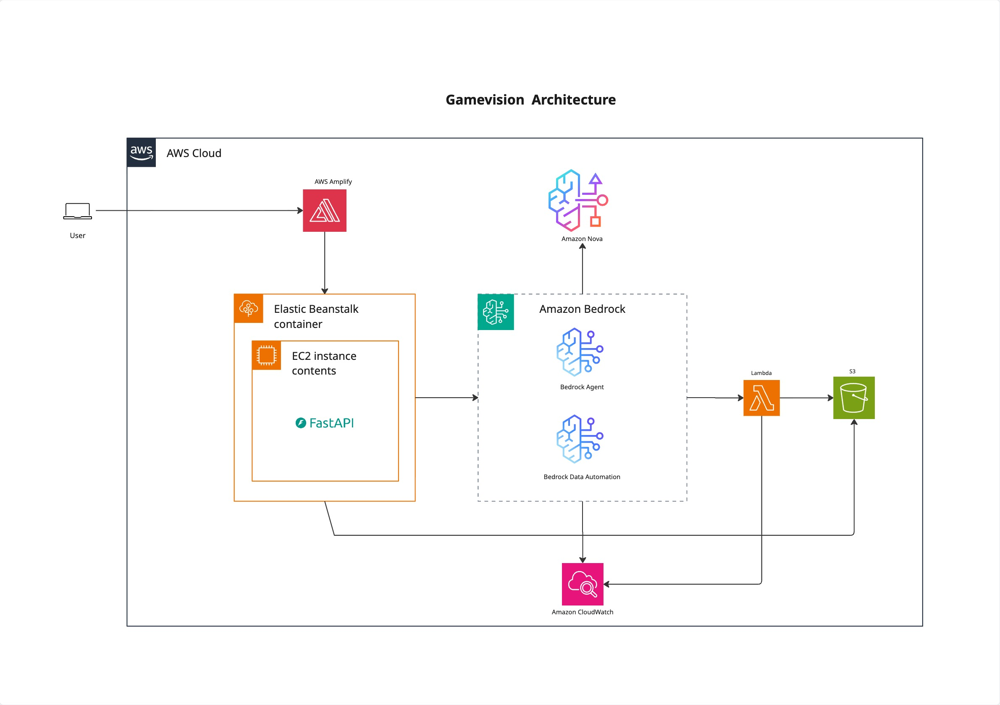

# Gameplay Analysis - Bedrock Agent

AI-powered video gameplay analysis platform using AWS Bedrock Agent and Data Automation.

## 🎥 Demo Video

[](https://www.youtube.com/watch?v=xeV91NwZz5U)

**Watch the demo:** [https://www.youtube.com/watch?v=xeV91NwZz5U](https://www.youtube.com/watch?v=xeV91NwZz5U)

## 🎯 Overview

A complete web application that enables users to:
- **Upload gameplay videos** via intuitive ui
- **Automatically analyze** videos using AWS Bedrock Data Automation
- **Ask questions** about gameplay in natural language
- **Get AI insights** powered by Nova pro

## 🏗️ Architecture



### System Components

```
┌─────────────────┐    ┌─────────────────┐    ┌─────────────────┐
│   Frontend UI   │    │   Backend API   │    │ Bedrock Agent   │
│                 │    │                 │    │                 │
│ • Video Upload  │◄──►│ • S3 Integration│◄──►│ • Video Analysis│
│ • Chat Interface│    │ • Agent Proxy   │    │ • Q&A Handling  │
│ • Real-time UI  │    │ • REST API      │    │ • Context Memory│
└─────────────────┘    └─────────────────┘    └─────────────────┘
        │                       │                        │
        │                       ▼                        ▼
        │              ┌─────────────────┐    ┌─────────────────┐
        │              │   AWS Services  │    │ Lambda Functions│
        │              │                 │    │                 │
        │              │ • S3 Storage    │    │ • Video Processor│
        │              │ • Bedrock Data  │    │ • Analysis Handler│
        │              │   Automation    │    │ • Query Handler │
        │              └─────────────────┘    └─────────────────┘
        │
        ▼
┌─────────────────┐
│  AWS Amplify    │
│                 │
│ • CDN Hosting   │
│ • CI/CD         │
│ • HTTPS         │
└─────────────────┘
```

## 🚀 Quick Start

### Prerequisites

- **AWS Account** with access to Bedrock, S3, Lambda, and Amplify
- **Node.js 16+** and npm
- **Python 3.11+** and pip
- **AWS CLI** configured

### 1. Clone Repository

```bash
git clone <your-repo-url>
cd gameplay-analysis-strands/bedrock-agent
```

### 2. Setup Backend

See detailed instructions in [Backend README](backend/README.md)

```bash
# Quick setup
cd backend
pip install -r requirements.txt

# Set up AWS infrastructure (automated)
cd ../infrastructure
./deploy.sh infra-setup

# Start local development server
cd ../backend
python api_server.py
```

### 3. Setup Frontend

See detailed instructions in [Frontend README](frontend/README.md)

```bash
# Quick setup
cd frontend
npm install

# Configure environment
cp .env.local.example .env.local
# Edit .env.local with your backend URL

# Start development server
npm start
```

## 📚 Documentation

### Setup & Deployment Guides

- **[Frontend README](frontend/README.md)** - React app setup, local development, and AWS Amplify deployment
- **[Backend README](backend/README.md)** - FastAPI setup, AWS infrastructure, and Elastic Beanstalk deployment
- **[Infrastructure README](infrastructure/README.md)** - Deployment scripts and infrastructure setup

### Key Features

- **Drag-and-Drop Upload**: Intuitive video upload interface
- **Automatic Analysis**: AI-powered gameplay analysis using Bedrock Data Automation
- **Natural Language Q&A**: Ask questions about videos in plain English
- **Real-time Updates**: Live status updates during processing
- **Context Preservation**: Maintains conversation history across interactions

## 🛠️ Tech Stack

### Frontend
- React 18+ with TypeScript
- Material-UI (MUI)
- AWS Amplify (hosting)

### Backend
- Python 3.11+ with FastAPI
- AWS Bedrock Agent (Nova Pro)
- AWS Lambda (serverless functions)
- AWS S3 (video storage)
- Elastic Beanstalk (hosting)

### AI/ML
- AWS Bedrock Data Automation
- Custom sports analysis blueprint
- Nova Pro model

## 📁 Project Structure

```
bedrock-agent/
├── frontend/                    # React web application
│   ├── src/
│   │   ├── components/         # UI components
│   │   ├── hooks/              # Custom React hooks
│   │   └── services/           # API services
│   ├── package.json
│   └── README.md               # Frontend documentation
│
├── backend/                     # FastAPI backend
│   ├── api_server.py           # Main API server
│   ├── lambda-functions/       # AWS Lambda functions
│   ├── bedrock-agent/          # Agent configuration
│   ├── bedrock-data-automation/ # BDA blueprints
│   ├── shared/                 # Shared utilities
│   ├── requirements.txt
│   └── README.md               # Backend documentation
│
├── infrastructure/             # Deployment scripts
│   ├── deploy.sh              # AWS infrastructure setup
│   ├── deploy-to-eb.sh        # Elastic Beanstalk deployment
│   └── README.md              # Infrastructure documentation
└── README.md                   # This file
```

## 🔧 Configuration

### Environment Variables

**Backend** (`.env`):
```bash
AWS_REGION=us-east-1
AWS_BUCKET_NAME=your-video-bucket
BEDROCK_AGENT_ID=your-agent-id
BEDROCK_AGENT_ALIAS_ID=your-alias-id
VIDEO_PROCESSOR_ARN=your-lambda-arn
ANALYSIS_PROCESSOR_ARN=your-lambda-arn
QUERY_HANDLER_ARN=your-lambda-arn
```

**Frontend** (`.env.local`):
```bash
REACT_APP_API_URL=http://localhost:8000
```

See individual README files for complete configuration details.

## 🚢 Deployment

### Backend Deployment (Elastic Beanstalk)

```bash
cd backend

# Initialize and deploy
eb init -p python-3.11 gameplay-analysis-backend --region us-east-1
eb create gameplay-analysis-env --instance-type t3.small

# Get backend URL
eb status | grep CNAME
```

See [Backend README](backend/README.md) for detailed deployment instructions.

### Frontend Deployment (AWS Amplify)

1. Connect Git repository to AWS Amplify Console
2. Configure build settings (uses `amplify.yml`)
3. Add environment variable: `REACT_APP_API_URL`
4. Deploy

See [Frontend README](frontend/README.md) for detailed deployment instructions.

## 🧪 Testing

### Test Backend

```bash
# Health check
curl http://localhost:8000/health

# Upload test
curl -X POST http://localhost:8000/upload \
  -H "Content-Type: application/json" \
  -d '{"filename": "test.mp4", "content_type": "video/mp4"}'
```

### Test Frontend

```bash
cd frontend
npm start
# Open http://localhost:3000
# Test video upload and chat functionality
```

## 🐛 Troubleshooting

### Common Issues

**Backend not connecting:**
- Check AWS credentials: `aws sts get-caller-identity`
- Verify environment variables in `.env`
- Check backend logs: `tail -f backend/api_server.log`

**Frontend CORS errors:**
- Verify `REACT_APP_API_URL` is correct
- Check backend CORS configuration in `api_server.py`

**Video upload fails:**
- Verify S3 bucket exists and has correct permissions
- Check Lambda function logs in CloudWatch
- Ensure IAM roles have proper policies

**Chat not responding:**
- Verify Bedrock Agent ID and Alias ID
- Check Agent is in "Prepared" state in AWS Console
- Review Lambda function logs

See individual README files for detailed troubleshooting guides.

## 💰 Cost Estimate

### Development Environment
- **Backend (EB)**: ~$15/month (t3.small)
- **Frontend (Amplify)**: ~$0-5/month (free tier eligible)
- **Lambda**: ~$1-5/month (pay per invocation)
- **S3**: ~$1-3/month (storage + requests)
- **Bedrock**: ~$10-50/month (pay per token)
- **Total**: ~$30-80/month

### Production Environment
- **Backend (EB)**: ~$50-150/month (t3.medium + auto-scaling)
- **Frontend (Amplify)**: ~$5-20/month (higher traffic)
- **Lambda**: ~$10-30/month (higher volume)
- **S3**: ~$5-20/month (more storage)
- **Bedrock**: ~$50-200/month (higher usage)
- **Total**: ~$120-420/month

## 🔒 Security Considerations

- Never commit `.env` files to Git
- Use AWS Secrets Manager for production credentials
- Enable HTTPS for all production endpoints
- Implement rate limiting on API endpoints
- Use presigned URLs with short expiration for S3
- Follow principle of least privilege for IAM roles
- Enable CloudTrail for audit logging

## 📊 Monitoring

### CloudWatch Logs

- **Lambda Functions**: `/aws/lambda/gameplay-*`
- **Elastic Beanstalk**: `/aws/elasticbeanstalk/gameplay-analysis-env/`
- **Bedrock Agent**: Check in Bedrock console

### Metrics to Monitor

- API response times
- Lambda invocation counts and errors
- S3 storage usage
- Bedrock token usage
- Frontend error rates

## 🎯 Workflow

1. **User uploads video** via ui
2. **Frontend** gets presigned S3 URL from backend
3. **Video uploaded** directly to S3
4. **Lambda function** triggered on S3 upload
5. **Bedrock Data Automation** analyzes video
6. **Analysis results** stored in S3
7. **User asks questions** in chat
8. **Bedrock Agent** answers using analysis data
9. **Conversation continues** with context preserved

## 📝 Development Workflow

1. Make changes to frontend or backend
2. Test locally
3. Commit to Git
4. Push to trigger deployments:
   - Frontend: Auto-deploys via Amplify
   - Backend: Deploy with `eb deploy`
5. Verify in production

## 🆘 Support & Resources

### Documentation
- [AWS Bedrock Documentation](https://docs.aws.amazon.com/bedrock/)
- [FastAPI Documentation](https://fastapi.tiangolo.com/)
- [React Documentation](https://react.dev/)
- [AWS Amplify Documentation](https://docs.amplify.aws/)

### Getting Help
- Check individual README files for detailed guides
- Review CloudWatch logs for errors
- Test endpoints individually to isolate issues
- Verify AWS service quotas and limits

## 🎉 Next Steps

After initial setup:

1. ✅ Deploy backend to Elastic Beanstalk
2. ✅ Deploy frontend to AWS Amplify
3. ✅ Test end-to-end workflow
4. ✅ Configure custom domain (optional)
5. ✅ Set up monitoring and alerts
6. ✅ Implement authentication (optional)
7. ✅ Optimize costs and performance

## 📄 License

Apache License 2.0 - See LICENSE file for details.

---

**Project Status**: Production Ready 🚀

For detailed setup and deployment instructions, see:
- [Frontend README](frontend/README.md)
- [Backend README](backend/README.md)
